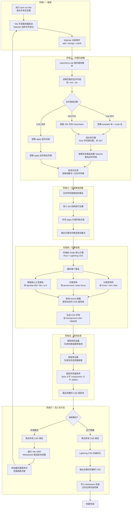

# Tailwind CSS

- 【初中级】有了解过哪些样式实现方案？为什么 AI 产品都选择 Tailwind CSS 作为样式方案?
- 【中高级】说说 Tailwind CSS 工程初始化、内核、工具类体系完整内容，详细说明在业务、组件库等场景的应用
- 【专家级】站在前端架构师角度，详细说说 Tailwind CSS 框架优势及原理，如何从零到一构建 Tailwind 及相关组件库生态

## 主流 CSS 样式实现方案演进

CSS 方案的演进，本质上是在"可维护性"、"开发效率"、"性能"这三个核心诉求之间寻找最佳平衡。

- 手写原生 CSS 或 CSS 预处理器（Sass/Less）

  痛点：随着项目变大，很快就会面临命名冲突、代码冗余、缺乏逻辑组织、难以维护等问题，即”CSS 全局命名空间污染”。

  解决方案：

  - CSS 预处理器（Sass/Less）：引入变量、嵌套、混入（Mixin）、继承等编程概念，增强了 CSS 的组织性和可复用性，但并未从根本上解决命名和全局污染问题

  - CSS 命名规范（BEM）：通过严格的命名约定（如：Block Element Modifier）来约束作用域，增强代码的可读性和可维护性。BEM 是一个非常优秀的规范，但它依赖于开发者的自觉性，且类名会变得很长

    [组件化开发必知的CSS命名规范——BEM](https://juejin.cn/post/7281911124806926377)

- CSS in JS（Styled-components❌/Emotion）

  在 React 等组件化框架兴起后，将样式也视为组件的一部分成为一种趋势。

  - 核心思想：将 CSS 样式直接写在 JavaScript 文件中，为每个组件生成唯一的、带哈希值的类名，从而实现“作用域化样式"，彻底解决了全局污染问题
  - 优势：
    - 组件化：样式与组件逻辑内聚，方便复用和维护。
    - 动态样式：可以方便地基于组件的 props 或 state 动态改变样式
  - 问题：
    - 运行时开销：需要在运行时解析 JS 并生成 CSS，带来一定的性能损耗
    - 心智负担：在 JS 和 CSS 之间切换语法，并且需要学习特定库的 API

- Utility-First CSS（Tailwind CSS）

  这是一种与传统“语义化 CSS"截然不同的思路，它提供了一系列高度可组合的、功能单一的“原子类”（Atomic CSS / Utility Classes）

  - 核心思想：你不再为组件编写专门的 CSS 类，而是直接在 HTML 中组合这些原子类来构建样式

  优势：

  - 无需思考命名：从根本上消除了为 class 命名的烦恼
  - 无需切换文件：样式和结构在一起，开发心流不被打断
  - 极致的性能：通过 PurgeCSS 等工具，在构建时扫描你的文件，只将用到的原子类打包到最终的 CSS 文件中，体积通常只有几 KB
  - 约束与一致性：所有样式都来自预设的 design tokens（在 tailwind.config.js 中定义），保证了整个项目视觉上的一致性。

## 为什么 AI 时代，Tailwind CSS 更受欢迎

- 追求极致的开发和迭代速度
  - 快速原型搭建：AI 产品的核心是背后的模型和算法，UI 界面需要快速搭建和调整以配合功能迭代。Tailwind 让前端开发者可以像积木一样，在 HTML 中迅速构建出美观且功能完备的界面，而无需花费大量时间编写和组织 CSS 代码
  - 所见即所得：原子类的直观性让开发者甚至产品经理能直接从 HTML 代码中读懂样式，大大降低了沟通成本和修改界面的心智负担
- 专注功能，而非繁琐的样式细节
  - 解放生产力：Tailwind 让开发者从"我该给这个div取什么名字？"、"这个样式会不会影响其他页面？"这类问题中解放出来，将更多精力投入到复杂的前端逻辑与 AI 模型的交互上
  - 统一的设计系统：通过一份 `tailwind.config.js` 配置文件，可以定义整个应用的色彩、间距、字体、边框等设计规范
- 与现代前端框架的完美契合
  - 组件内聚性：Tailwind 的原子类与组件化思想是天作之合。一个组件的所有依赖（逻辑、结构、样式）都清晰地体现在其文件中，这使得组件的移植、复用和删除都变得极其简单和安全，你再也不用担心删除一个组件后，留下一堆"僵尸样式"
  - 性能优势：对于复杂的 AI 应用仪表盘，可能会有成百上千个组件。如果使用传统 CSS，文件体积会线性增长。而 Tailwind 通过摇树（Tree-shaking），最终生成的 CSS 文件大小只与你用到的原子类数量有关，与组件数量无关，体积极小，加载飞快。

## 工程初始化 Tailwind

以 Vite + Vue + Tailwind v4 为例，从零搭建一个项目。

1. 创建 Vite + Vue 项目

   ```bash
   $ pnpm create vite demo --template=vue-ts
   ```

2. 安装核心依赖

   ```bash
   $ pnpm add -D tailwindcss @tailwindcss/vite@next
   ```

3. 配置 `vite.config.ts`

   Tailwind v4 最大变化之一是"零配置"优先——你不再需要 `tailwind.config.ts` 和 `postcss.config.js` 文件，只需在 Vite 插件中注册即可。颜色、间距等设计令牌直接在 CSS 文件中通过 `@theme` 指令定义，构建工具会自动识别

   ```ts
   import { defineConfig } from 'vite'
   import tailwindcss from '@tailwindcss/vite'
   
   export default defineConfig({
     plugins: [tailwindcss()]
   })
   ```

4. 创建并引入主 CSS 文件

   在你的 `src` 目录下创建一个 CSS 文件，例如：`src/style.css`，并写入 Tailwind 的核心指令

   ```css
   @import 'tailwindcss';
       
   :root {
     --color-primary: #008bff;
   }
   ```

## 核心概念剖析

掌握以下核心概念，是高效使用 Tailwind 的基础。

### 使用实用程序类（Utility Classes）进行样式设置

这是 Tailwind 的基石，每一个类名都代表一个**单一、不可再分**的 CSS 属性。

- `font-bold` 对应 `font-weight: 700`
- `text-center` 对应 `text-align: center`
- `p-4` 对应 `padding: 1rem`
- `flex` 对应 `display: flex`

这种模式让你留在 HTML 中完成所有样式工作，极大提升了开发的心流体验

### 悬停、焦点和其他状态（State Modifiers）

通过添加前缀修饰符，可以为不同状态应用样式、语法，极其直观：`状态：工具类`

```html
<button
  class="bg-blue-500 hover:bg-blue-700 focus:ring-blue-500 dark:text-yellow-300 rounded-xl"
>
  Click Me
</button>
```

### 颜色色值（Colors）

Tailwind 提供了一套精心设计、覆盖全面的调色板，每个颜色都有从 `50` 到 `950` 的不同色阶

- 标准用法：`bg-red-500`、`text-emerald-400`
- 任意值（Arbitrary Values）：如果预设值不满足需求，可以使用方括号动态生成一个，同时避免了编写自定义 CSS 的需要

```html
<div class="bg-[#1DA1F2] text-[14px] h-[55px]">Custom styles on the fly</div>
```

### 添加自定义样式（`@apply`、`theme()`、`@utility`）

虽然 Tailwind 鼓励使用工具类，但有时也需要封装或自定义。下面按从易到难的顺序介绍三种扩展方式。

`@apply`：组合现有工具类

- 当你发现有一组工具类被反复使用时，可以用 `@apply` 将它们组合成一个新的、类似传统 CSS 的类

```css
.btn-primary {
  @apply bg-blue-500 text-white font-bold py-2 px-4 rounded;
}
.btn-primary:hover {
  @apply bg-blue-700;
}
```

**最佳实践警告：谨慎使用`@apply`**。过度使用它会让你回到传统 CSS 的老路，失去工具带来的部分优势。优先考虑将重复的 UI 封装成组件。

### `theme()`：引用设计令牌

在自定义 CSS 中，如果你想使用 tailwind.config.js（或 v4 的 Vite 插件配置）中定义的设计令牌（如颜色、间距），可以使用 `theme()` 函数来保持一致性

```css
.custom-border {
  border: 2px solid theme("colors.rose.500");
}
```

### `@utility`：创建新的工具类（v4新特性）

这是 v4 的强大功能，允许你创建全新的、可被修饰符（如 hover:）作用的工具类

```css
@import 'tailwindcss';

:utility .text-shadow {
  text-shadow: 2px 2px 4px theme("colors.black / 50%");
}
```

## 在通用组件库中的应用

开发一个给别人使用的组件库时，思路需要转变。你的目标不是定死样式，而是提供一个**无头（Headless）**或**易于主题化**的骨架。

**无头组件（Headless UI）**模式：

这是最灵活的方式。你的组件只提供功能和状态管理，完全不提供任何样式

- 实现方式：组件通过作用域插槽（`scoped slots`）将内部状态和方法暴露出去，让使用者自己决定用什么 HTML 标签和 Tailwind 类来渲染
- 例子：`Headless UI` 库就是这种模式的典范。它提供了一个 `Menu` 组件，但按钮和下拉项长什么样完全由你决定

```vue
<template>
  <Menu>
    <MenuButton>More</MenuButton>
    <MenuItems>
      <MenuItem v-slot="{ active }">
        <a :class='{ "bg-blue-500": active }' href="/account-settings">
          Account settings
        </a>
      </MenuItem>
      <MenuItem v-slot="{ active }">
        <a :class='{ "bg-blue-500": active }' href="/docs">
          Documentation
        </a>
      </MenuItem>
      <MenuItem disabled>
        <span class="opacity-75">Invite a friend (coming soon!)</span>
      </MenuItem>
    </MenuItems>
  </Menu>
</template>
```

**可主题化（Themable）模式**

提供一套默认样式，但允许使用者轻松地进行覆盖和定制。

实现方式：

- 使用 `@apply` 为组件定义一套基础的、结构化的 class
- 将关键的可变样式（如颜色、边框、背景）通过 CSS 自定义属性（CSS Variables）暴露出来
- 使用者不需要修改你的组件库源码，只需要在自己的项目中覆盖这些 CSS 变量，就能实现主题切换（比如暗黑模式）

```css
@theme {
  --color-btn-green: #00ce5c;
  --color-btn-yellow: #ffda7c;
  --color-btn-blue: #008bff;
  --color-btn-red: #ff4a4a;
}

@utility btn-* {
  background-color: --value(--color-btn-*);
}
```

如果是 Tailwind v3 项目，可以在 `tailwind.config.js` 中配置等价的设计令牌：

```js
export default {
  theme: {
    colors: {
      btn: {
        green: "#00ce5c",
        yellow: "#ffda7c",
        blue: "#008bff"
      }
    },
    extend: {
      fontFamily: {
        sans: ["Inter", "sans-serif"]
      }
    }
  }
};
```

## Tailwind CSS 原理

### Tailwind 优势

从架构层面看，Tailwind CSS 解决的不仅仅是样式编写效率问题，更是大型、长期项目中 CSS 维护的根本性难题。

1. 约束即自由：强制性的设计系统
   - 在大型团队中，最大的敌人是“熵增”——即系统的混乱度会随时间和人员的增加而不断提高。在 CSS 领域，这表现为颜色的滥用、间距的随意、字体的混乱。
   - 架构优势：Tailwind 通过其配置文件（tailwind.config.js 或 v4 的插件配置）强制实现了一个代码化的设计系统（Design System as Code）。颜色、间距、字体等设计令牌（Design Tokens）被集中管理，开发者只能在这些受约束的选项内进行选择。这从根本上杜绝了“魔术数字”和个人偏好，保证了整个应用视觉层面的高度一致性和可预测性。
2. 杜绝CSS熵增：可预测的样式维护
   - 传统 CSS 最大的痛点是全局污染和样式覆盖。修改一个全局的 .card 类，你无法确定会影响到多少个不相关的页面，导致“牵一发而动全身”，最终没人敢删除旧代码，CSS 文件无限膨胀。
   - 架构优势：Tailwind 将样式与 HTML 结构绑定，实现了真正的样式本地化。一个组件的样式完全内聚于其模板中。当你删除一个组件时，与之相关的所有样式定义（即 HTML 中的类名）也一并被移除了。重构和删除代码变得前所未有的安全，彻底解决了“CSS废代码”的累积问题。
3. 极致性能：与项目规模解耦的最终产物
   - 无论你的项目有 10 个组件还是 1000 个组件，最终生成的 CSS 文件大小只与你实际用到的原子类数量有关。
   - 架构优势：这种按需生成机制确保了最终产物的体积始终保持在最小。对于需要极致加载性能的大型应用（如电商、在线文档）来说，这是一个决定性的优势。应用规模可以无限扩展，而 CSS 的性能开销几乎是恒定的。
4. 降低心智负担，提升团队速度
   - 传统开发中，开发者需要花费大量时间在“BEM命名”、“文件组织结构”、“防止样式冲突”上。
   - 架构优势：Tailwind 提供了一套标准化的、通用的样式“语言”。新成员加入团队，无需学习项目内部复杂的 CSS 架构，只需了解 Tailwind 的语法即可快速上手。这极大地降低了团队的沟通成本和新成员的融入成本，让整个团队能更专注于业务逻辑的实现。

### 核心原理与工作流程

Tailwind CSS 是一个编译时框架（Build-Time Framework），它的魔法完全发生在代码构建阶段，对客户端的运行时性能几乎没有影响。

核心流程拆解：

整个过程可以概括为"扫描 → 生成 → 注入"六个步骤：

1. **触发**：当 Vite 开发服务器启动或任何被监视的文件（如 `.vue`）发生变化时。
2. **扫描与提取**：`@tailwindcss/vite` 插件会立即扫描你在配置中指定的所有内容文件。它使用高效的方式（如 AST 分析或正则表达式）来提取出所有看起来像 Tailwind 类名的字符串。
3. **生成候选列表**：所有找到的类名被收集到一个无重复的集合（Set）中。
4. **引擎处理**：这个类名集合被传递给 Tailwind 的核心引擎（v4 中由 Rust 编写的 Lightning CSS 驱动）。
5. **规则生成**：引擎逐一解析每个类名。
   - 它首先分离出修饰符（如 `hover:`、`md:`、`dark:`）。
   - 然后解析核心工具类（如 `bg-blue-500`）。
   - 它根据内置规则和你的配置，生成对应的 CSS 声明（如 `background-color: #3b82f6`）。
   - 最后，它将 CSS 声明用修饰符对应的伪类或媒体查询包裹起来。
6. **注入 / 打包**：引擎将所有生成好的 CSS 规则聚合成一个单一的 CSS 文件，然后 Vite 将这个文件通过 HMR 注入到开发中的页面，或在生产构建时将其打包。



### 迷你引擎

下面通过一个精简版实现来理解 Tailwind 的核心工作流程。整个引擎分为三个阶段：

**阶段一：扫描收集**

Vite 插件在 `transform` 钩子中拦截所有 `.vue`、`.jsx`、`.tsx`、`.html` 等文件，用正则 `/class=["']([^"']+)["']/g` 提取 `class` 属性中的类名字符串，拆分后存入全局 `Set` 去重。这一步模拟了 Tailwind 的内容扫描（content scanning）——真实引擎用的是 Rust 字符串匹配 + AST 分析，这里简化为纯正则。

**阶段二：规则生成**

`generateCss` 遍历类名集合，对每个类名调用 `resolveStyle` 解析。解析过程分三步：

1. **分离修饰符**：检查类名是否以 `hover:`、`focus:` 等前缀开头，有则提取为 CSS 伪类，剩余部分继续解析
2. **模式匹配**：用正则匹配 `p-4`（间距）、`bg-blue-500`（背景色）、`text-red-500`（文字色）等模式，从 `theme` 对象中查找对应的设计令牌值。找不到模式则回退到静态映射表（`flex`、`font-bold` 等）
3. **拼接规则**：将解析出的 CSS 属性拼接为声明块，修饰符以伪类形式追加到选择器后（如 `.bg-blue-500:hover`）

**阶段三：注入页面**

`transformIndexHtml` 钩子在 HTML 生成阶段触发，将所有 CSS 规则聚合成一个 `<style>` 标签，通过 `injectTo: "head-prepend"` 注入到 `<head>` 的最前面。开发模式下，Vite HMR 会自动触发这个流程，实现样式热更新。

```js
// ============================================================
//  设计令牌 —— 模拟 Tailwind 的 theme 配置
// ============================================================
const theme = {
  colors: {
    blue:   { 500: '#3b82f6', 700: '#1d4ed8' },
    red:    { 500: '#ef4444' },
    green:  { 500: '#22c55e' },
    white:  '#ffffff',
    black:  '#000000'
  },
  spacing: {
    0: '0',
    1: '0.25rem',
    2: '0.5rem',
    4: '1rem',
    6: '1.5rem'
  }
}

// 修饰符 → CSS 伪类映射
const modifiers = {
  hover:  ':hover',
  focus:  ':focus',
  active: ':active'
}

// ============================================================
//  工具类 → CSS 声明 解析器
// ============================================================
function resolveStyle(className) {
  let modifier = null

  // 分离修饰符：hover:bg-blue-500 → modifier=':hover', base='bg-blue-500'
  for (const [prefix, pseudo] of Object.entries(modifiers)) {
    if (className.startsWith(prefix + ':')) {
      modifier = pseudo
      className = className.slice(prefix.length + 1)
      break
    }
  }

  const base = className
  let declarations = null

  // 内边距 / 外边距：p-4 → padding: 1rem
  {
    const m = base.match(/^(p|m)([xy]?)-(\d+)$/)
    if (m) {
      const prop = { p: 'padding', m: 'margin' }[m[1]]
      const dir  = { x: 'inline', y: 'block' }[m[2]] || ''
      const name = dir ? `${prop}-${dir}` : prop
      declarations = { [name]: theme.spacing[m[3]] }
    }
  }

  // 背景色：bg-blue-500 → background-color: #3b82f6
  if (!declarations) {
    const m = base.match(/^bg-(\w+)-(\d+)$/)
    if (m && theme.colors[m[1]]?.[m[2]]) {
      declarations = { 'background-color': theme.colors[m[1]][m[2]] }
    }
  }

  // 文字色：text-red-500 → color: #ef4444
  if (!declarations) {
    const m = base.match(/^text-(\w+)-(\d+)$/)
    if (m && theme.colors[m[1]]?.[m[2]]) {
      declarations = { color: theme.colors[m[1]][m[2]] }
    }
  }

  // 静态工具类兜底
  if (!declarations) {
    const staticUtils = {
      'flex':        { display: 'flex' },
      'grid':        { display: 'grid' },
      'font-bold':   { 'font-weight': '700' },
      'text-center': { 'text-align': 'center' },
      'text-white':  { color: theme.colors.white },
      'rounded':     { 'border-radius': '0.25rem' },
      'rounded-xl':  { 'border-radius': '0.75rem' }
    }
    declarations = staticUtils[base] || null
  }

  return { base, modifier, declarations }
}

// ============================================================
//  阶段二：候选类名 → CSS 字符串
// ============================================================
export function generateCss(classNames) {
  const rules = [] // [{ selector, body }]

  for (const className of classNames) {
    const { base, modifier, declarations } = resolveStyle(className)
    if (!declarations) continue

    // 拼接 CSS 属性列表
    const body = Object.entries(declarations)
      .map(([prop, val]) => `${prop}: ${val};`)
      .join('')

    // 有修饰符时，伪类追加在选择器后面
    const selector = modifier ? `.${base}${modifier}` : `.${base}`
    rules.push({ selector, body })
  }

  // 简单去重：同名选择器合并
  const merged = {}
  for (const { selector, body } of rules) {
    merged[selector] = (merged[selector] || '') + body
  }

  let css = ''
  for (const [selector, body] of Object.entries(merged)) {
    css += `${selector} { ${body} }`
  }
  return css
}

// ============================================================
//  Vite 插件入口
// ============================================================
const globalClassNames = new Set()

export function tailwindPlugin() {
  return {
    name: 'vite-plugin-tailwind',
    enforce: 'post',

    // 阶段一：扫描文件，收集类名
    transform(code, id) {
      if (/\.(vue|svelte|jsx|tsx|html)$/.test(id)) {
        const regex = /class=["']([^"']+)["']/g
        let match
        while ((match = regex.exec(code)) !== null) {
          match[1]
            .split(/\s+/)
            .filter(Boolean)
            .forEach(name => globalClassNames.add(name))
        }
      }
      return code
    },

    // 阶段三：生成 CSS 并注入 HTML
    transformIndexHtml() {
      const finalCSS = generateCss(Array.from(globalClassNames))
      return [{
        tag: 'style',
        attrs: { id: 'tailwind-css' },
        children: finalCSS,
        injectTo: 'head-prepend'
      }]
    }
  }
}
```

> 这个精简实现约 100 行，覆盖了 Tailwind 的几个核心机制：**设计令牌（theme）→ 模式匹配解析（regex）→ 修饰符分离 → CSS 生成**。真实引擎在此基础上还增加了响应式断点（`md:`、`lg:`）、暗黑模式变体（`dark:`）、`@apply` 展开、按层优先级排序（base < components < utilities）以及 Lightning CSS 压缩优化，但核心管线完全一致。

## 总结

Tailwind CSS 从"工具类优先"这一看似激进的理念出发，实际解决的却是 CSS 工程中最古老的问题：命名冲突、样式泄漏、死代码累积。它的核心策略可以归纳为三条：

1. **约束即设计系统**：将颜色、间距、字体等设计令牌统一管理，用有限的原子类替代无限的随意值，保证视觉一致性
2. **按需即性能**：扫描源码提取类名 → 按名生成 CSS → 摇树移除未使用样式，产物体积与项目规模解耦
3. **内聚即可维护**：样式与组件模板共存于同一文件，增删组件时样式同步增减，杜绝"僵尸样式"

无论是用于快速搭建 AI 产品原型，还是构建大型企业级应用，Tailwind 提供的不仅是一套 CSS 工具类，更是一种经得起规模考验的样式管理范式。

